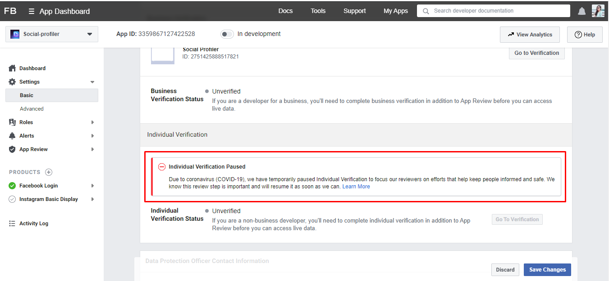

# SocialProfiler

This project contains basic authentication and facebook feeds and twitter feeds list.
## Development server
Run `npm install` to install dependencies. After that
run `ng serve` for a dev server. Navigate to `http://localhost:4200/`. The app will automatically reload if you change any of the source files.

To RUN the backend server please [click Here](https://github.com/rashmi-s-jain/Social-profiler-backend)
## Build

Run `ng build` to build the project. The build artifacts will be stored in the `dist/` directory. Use the `--prod` flag for a production build.

## Features
Login, Register and Login with google.

Link facebook account to see the feeds.
Link twitter account to see the feeds. You will require a twitter username to include twitter feeds.

## Note
Not implemented Instagram feeds because individual app will not go for the review process and the review process of individual apps are stopped by instagram because of COVID-19 crises. I have tried using business account but it requires all licence certificates for the verification.

Please find attached image

